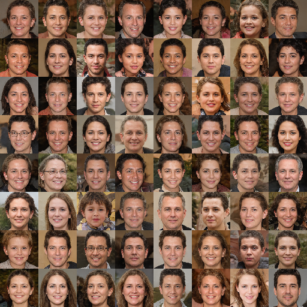

## Introduction
This repository contains a reproduction of the [StyleGAN2 paper](https://arxiv.org/pdf/1912.04958) in PyTorch. It supports multi-GPU training through PyTorch DDP. This implementation supports both non-saturating vanilla GAN loss and Wasserstein loss.

## Table of contents

* [Training Script](#training)
* [Data](#data)
* [Loss plotting](#loss-plotting)
* [Inference](#inference)
* [Demonstration](#demonstration)

## Training
To train a StyleGAN2 model from scratch, or continue training an existing one you can use **trainer.py** script:
```
usage: trainer.py [-h] [--latent_dim LATENT_DIM] [--batch_size BATCH_SIZE] [--grad_accum GRAD_ACCUM] [--mn_depth MN_DEPTH] [--training_steps TRAINING_STEPS] [--target_num_images TARGET_NUM_IMAGES]
                  [--loss_type LOSS_TYPE] [--save_every SAVE_EVERY] [--learning_rate LEARNING_RATE] [--mlp_lr_mul MLP_LR_MUL] [--style_mixing_prob STYLE_MIXING_PROB] [--gen_ema_beta GEN_EMA_BETA]
                  [--ema_steps_threshold EMA_STEPS_THRESHOLD] [--network_capacity NETWORK_CAPACITY] [--gen_use_tanh_last GEN_USE_TANH_LAST] [--disc_use_mbstd DISC_USE_MBSTD]
                  [--style_mixing_probs_inference STYLE_MIXING_PROBS_INFERENCE [STYLE_MIXING_PROBS_INFERENCE ...]] [--truncation_psis_inference TRUNCATION_PSIS_INFERENCE [TRUNCATION_PSIS_INFERENCE ...]]
                  [--fir_filter_sampling FIR_FILTER_SAMPLING [FIR_FILTER_SAMPLING ...]] [--w_ema_beta W_EMA_BETA] [--max_filters MAX_FILTERS] [--mbstd_group_size MBSTD_GROUP_SIZE]
                  [--mbstd_num_channels MBSTD_NUM_CHANNELS] [--images_in_channels IMAGES_IN_CHANNELS] [--ddp_backend DDP_BACKEND] [--from_checkpoint [FROM_CHECKPOINT]]
                  [--num_images_inference NUM_IMAGES_INFERENCE] [--num_rows_inference NUM_ROWS_INFERENCE] [--disc_optim_steps DISC_OPTIM_STEPS] [--random_seed RANDOM_SEED] [--no_w_ema [NO_W_EMA]]
                  [--w_estimate_samples W_ESTIMATE_SAMPLES] [--save_total_limit SAVE_TOTAL_LIMIT] [--sample_every SAMPLE_EVERY] [--no_training [NO_TRAINING]]
                  path_train target_res model_dir

positional arguments:
  path_train            Path to training set images
  target_res            Width and height of images.
  model_dir             Directory where model checkpoints and infered samples should be saved.

options:
  -h, --help            show this help message and exit
  --latent_dim LATENT_DIM
                        Dimensionality of style vectors (default: 512)
  --batch_size BATCH_SIZE
                        Per device batch size (default: 32)
  --grad_accum GRAD_ACCUM
                        Gradient accumulations steps to perform on each device before summing gradients (default: 4)
  --mn_depth MN_DEPTH   Depth of the mapping network (default: 8)
  --training_steps TRAINING_STEPS
                        Number of training steps (default: 1000)
  --target_num_images TARGET_NUM_IMAGES
                        Number of images to train the model on. Will override training-steps, if given (default: None)
  --loss_type LOSS_TYPE
                        GAN loss type to be used for the model. Can be vanilla or wgan (default: vanilla)
  --save_every SAVE_EVERY
                        Creates a model checkpoint every save-every steps. Also period of inference (default: 1000)
  --learning_rate LEARNING_RATE
                        Learning rate for optimizers (default: 0.002)
  --mlp_lr_mul MLP_LR_MUL
                        Reduces learning rate of mapping network by a factor of mlp-lr-mul (default: 0.01)
  --style_mixing_prob STYLE_MIXING_PROB
                        Style mixing probability to use during training (default: 0.9)
  --gen_ema_beta GEN_EMA_BETA
                        Decay coefficient for EMA of mapping network and generator weights (default: 0.999)
  --ema_steps_threshold EMA_STEPS_THRESHOLD
                        Compute EMA of mapping network and generator weights only after ema-steps-threshold training steps (default: 3000)
  --network_capacity NETWORK_CAPACITY
                        Multiplicative factor for number of filters in generator and discriminator. Number of features maps for generator layer that generates images of resolution 2^k is obtained as f(k) =
                        min(max_filters, network_capacity * 2^(log_2(target_res) - k + 1)), and similarly for discriminator layer that processes resolution 2^k has h(k) = min(max_filters, network_capacity *
                        2^(k - 1)). (default: 8)
  --gen_use_tanh_last GEN_USE_TANH_LAST
                        Use tanh in the last layer of generator to keep images in [-1, 1]. StyleGAN2 paper does not use this in the last layer (default: False)
  --disc_use_mbstd DISC_USE_MBSTD
                        Use minibatch-std in last layer of discriminator (default: True)
  --style_mixing_probs_inference STYLE_MIXING_PROBS_INFERENCE [STYLE_MIXING_PROBS_INFERENCE ...]
                        Different style mixing probabilities to try during inference, pass as a space-seperated list of floats (default: [0.0])
  --truncation_psis_inference TRUNCATION_PSIS_INFERENCE [TRUNCATION_PSIS_INFERENCE ...]
                        Different psi-s for truncation trick to use during inference, pass as a space-seperated list of floats (default: [1])
  --fir_filter_sampling FIR_FILTER_SAMPLING [FIR_FILTER_SAMPLING ...]
                        Unnormalized FIR filter to use in upsampling/downsampling layers (default: [1, 3, 3, 1])
  --w_ema_beta W_EMA_BETA
                        EMA coefficient to use when estimating mean style vector in mapping network during training (default: 0.995)
  --max_filters MAX_FILTERS
                        Maximum number of filters to use in convolutional layers of generator and discriminator (default: 512)
  --mbstd_group_size MBSTD_GROUP_SIZE
                        Minibatch standard deviation group size for discriminator, --batch-size should be divisible by this (default: 4)
  --mbstd_num_channels MBSTD_NUM_CHANNELS
                        Minibatch standard deviation number of channels for discriminator, should divide number of channels at the output of discriminator, before applying minibatchstd and flatten (default:
                        1)
  --images_in_channels IMAGES_IN_CHANNELS
                        Number of channels generated images/inspected images should have, 3 for RGB, 4 for RGBA, 1 for grayscale, etc. (default: 3)
  --ddp_backend DDP_BACKEND
                        DDP backend to use. If training on CPU, you should use gloo. Supported backends, and DDP documentation is available at: https://pytorch.org/docs/stable/distributed.html. If running
                        from Windows, you might want to run with gloo, as nccl is not supported (at least at the time of writhing these scripts) (default: nccl)
  --from_checkpoint [FROM_CHECKPOINT]
                        Continue training from latest checkpoint in model_dir (default: False)
  --num_images_inference NUM_IMAGES_INFERENCE
                        Number of images to generate for inference (default: 16)
  --num_rows_inference NUM_ROWS_INFERENCE
                        Number of rows to present generated images during inference. Should divide num_images_inference (default: 4)
  --disc_optim_steps DISC_OPTIM_STEPS
                        Number of optimizations steps for discriminator, before optimizing generator (default: 1)
  --random_seed RANDOM_SEED
                        Random seed for reproducibility. In multi GPU regime, this will be offset by global rank of each GPU, so each GPU will end up with a different seed (default: 1337)
  --no_w_ema [NO_W_EMA]
                        Should mapping network use EMA for estimating mean style vector or not (default: False)
  --w_estimate_samples W_ESTIMATE_SAMPLES
                        Number of samples taken from multivariate standard Normal distribution to use to estimate average style vector for truncation, in case --no_w_ema is turned on (default: 20000)
  --save_total_limit SAVE_TOTAL_LIMIT
                        Specifies number of model checkpoints that should be rotated. Non-positive value results in no limits (default: 1)
  --sample_every SAMPLE_EVERY
                        Generate samples every sample_every steps during training. These samples are saved under sampled subdirectory in model_dir, and should represent samples generated by model at
                        different stages of training (default: 1)
  --no_training [NO_TRAINING]
                        Creates the model/loads a checkpoint, log metadata without training (default: False)
```

If you want to train on a multi-GPU system, it is sufficient to prefix trainer.py script with appropriate torchrun command. For example training on a single node with $k \geq 2$ GPUs:
```
torchrun --nproc-per-node k --nnodes 1 trainer.py ...
```

**Training in a multi node-multi GPU environment was not tested!**

Model directory created by the previous script will look something like this:
```
│   .metadata.json # Contains metadata for the model
│   d_adversarial_loss.csv # Adversarial loss for discriminator.
│   d_gp.csv # Gradient penalty for discriminator.
│   g_adversarial_loss.csv # Adversarial loss for generator.
│   g_plr.csv # Path length regularization for generator.
|
├───checkpoint_x/ # Contains .pth files for the given checkpoint. Depending on the configuration, you could end up with multiple checkpoints.
│
└───training_samples/ # Contains image samples taken at different stages of training
    |    current_samples_k.jpg # Samples taken from generator after k training steps.
    |    ema_samples_k.jpg # Samples taken from exponential moving average of generator after k training steps. This is optional, depends on the configuration.
```

## Data
It should be noted that no data preprocessing scrips are present, you should only provide the path to your training images. It is assumed that images contain unnormalized pixel values in range [0, 255], they will be transformed to [-1, 1] range. Additionally, your images will automatically be resized to the nearest power of 2 in height and width, since it presents inconveniences for the StyleGAN2 architecture otherwise. 

## Loss plotting
You can use aforementioned .csv files to generate loss plots, using the **loss_plotter.py** script:
```
usage: loss_plotter.py [-h] model_dir

positional arguments:
  model_dir   Model directory used during training

options:
  -h, --help  show this help message and exit
```

It will generate up to 4 files, depending on training configuration: **d_adversarial_loss.png, d_gp.png, g_adversarial_loss.png, g_plr.png**, with filenames matching aforementioned CSV files.

## Inference 
You can use existing model checkpoints to perform inference through **inference.py**:
```
usage: inference.py [-h] [--truncation_psi TRUNCATION_PSI] [--inference_count INFERENCE_COUNT] [--num_samples NUM_SAMPLES] [--num_rows NUM_ROWS] [--random_seed RANDOM_SEED] [--no_ema [NO_EMA]]
                    [--w_estimate_samples W_ESTIMATE_SAMPLES]
                    model_dir inference_dir

positional arguments:
  model_dir             Model directory path, which contains .pth files for the trained StyleGAN2 instance.
  inference_dir         Directory in which inferred images should be saved.

options:
  -h, --help            show this help message and exit
  --truncation_psi TRUNCATION_PSI
                        Psi parameter for truncation trick, must be in [0, 1]. 1 Means no truncation, 0 means all samples coincide with estimated mean style vector.
  --inference_count INFERENCE_COUNT
                        Determines the number of times the inference will be repeated.
  --num_samples NUM_SAMPLES
                        Number of samples to generate.
  --num_rows NUM_ROWS   How many rows should the output sample grid have. Shoud evenly divide --num_samples.
  --random_seed RANDOM_SEED
                        Seed used for generation.
  --no_ema [NO_EMA]     Use EMA of generator weights or use generator from last training iteration. Defaults to True.
  --w_estimate_samples W_ESTIMATE_SAMPLES
                        If mapping network did not record EMA of style vectors seen during training, this parameter determines the number of samples used to estimate the mean style vector.
```

This will generate a directory with the following structure:
```
inference_dir
└───date_str # Date of inference
    ├───unix_timestamp # Unix timestamp for inference
    │       .run_metadata.json # Parameters used for this particular inference
    |       k.png # k-th image containing grid of samples
    │       truncation_base_k.png # Image that was use to truncate style vector distribution as per the truncation trick described in the paper, for k-th grid of samples
```

## Demonstration
I trained a model on the 64x64 version of the Flickd Faces Dataset, which can be found in [this Kaggle repository](https://www.kaggle.com/datasets/matheuseduardo/flickr-faces-dataset-resized). I used a cloud-based system with 2 NVIDIA T4 GPUs. For training I used all hyperparameters described in the paper, which translates to the following .metadata.json in the model directory:
```json
{
    "target_resolution": 64,
    "loss_type": "vanilla",
    "use_gp": true,
    "use_plr": true,
    "style_mixing_prob": 0.9,
    "style_mixing_prob_inference": [
        0.0
    ],
    "truncation_psi_inference": [
        1
    ],
    "gp_weight": 10.0,
    "pl_weight": 2.0,
    "pl_beta": 0.99,
    "disc_optim_steps": 1,
    "lazy_reg_steps_generator": 8,
    "lazy_reg_steps_discriminator": 16,
    "learning_rate": 0.002,
    "adam_beta1": 0.0,
    "adam_beta2": 0.99,
    "adam_eps": 1e-08,
    "gen_ema_beta": 0.999,
    "compute_generator_ema": true,
    "ema_steps_threshold": 3000,
    "w_estimate_samples": 20000,
    "mapping_network_params": {
        "latent_dim": 512,
        "depth": 8,
        "lr_mul": 0.01,
        "estimate_w": false
    },
    "generator_params": {
        "image_size": 64,
        "latent_dim": 512,
        "network_capacity": 256,
        "max_features": 512,
        "fir_filter": [
            1,
            3,
            3,
            1
        ],
        "use_tanh_last": false,
        "rgb_out_channels": 3
    },
    "discriminator_params": {
        "input_res": 64,
        "in_channels": 3,
        "network_capacity": 256,
        "max_features": 512,
        "use_mbstd": true,
        "mbstd_group_size": 4,
        "mbstd_num_channels": 1,
        "fir_filter": [
            1,
            3,
            3,
            1
        ]
    },
    "save_total_limit": 1
}
```
**Batch size** and **gradient accumulation** parameters are missing from the previous dictionary because they are options for trainer script and they are not serialized, but they were 8 and 2 respectively. Training was conducted over 132000 steps, which resulted in the discriminator seeing ~4 million images. Total training time was arround 5.2 days, which is not that high if you consider actual StyleGAN2 training times listed in the [official GitHub repository](https://github.com/NVlabs/stylegan2?tab=readme-ov-file#training-networks). You can find my model archive on [this link](https://drive.google.com/file/d/1FVDaT1O2pgEf_HEblUC9wi4jkVEp-xVy/view?usp=sharing). You can download the archive and use the inference script to generate faces: 
```bash
# Download the provided archive and extract content, to cwd for instance
python inference.py "stylegan2_ffhq128_no_w_ema_bs32_nc256_res64_newcheckpoint_132000" <inference_dir> ...
```
Or continue training yourself. 
```bash
# Download the provided archive and extract content, to cwd for instance
[optional torchrun] python trainer.py <dataset_dir> <target_resolution> "stylegan2_ffhq128_no_w_ema_bs32_nc256_res64_new" ...
```

An example of generated faces with previously provided checkpoint:



## Conclusion
According to the obtained results, this seems like a reasonable reproduction of the original StyleGAN2. This was my first time working with PyTorch DDP, so feel free to open issues/pull requests if you think that something can be improved. 

## TODOs/Notes
*  I did not evaluate my models using [FID - Freched Inception Distance](https://arxiv.org/pdf/1706.08500) as my main point of intereset was reproducing reasonably looking human faces, it is not hard to implement. Alternatively, you could use existing PyTorch implementations of FID, in that case I recommend taking a look at [this project](https://github.com/mseitzer/pytorch-fid).

* The training set I used contained some strange artifacts, which could have been translated to the model itself. Perhaps try training with a cleaner dataset. Try looking for a more powerful compute platform as well.